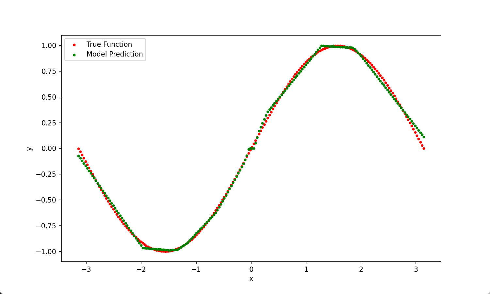
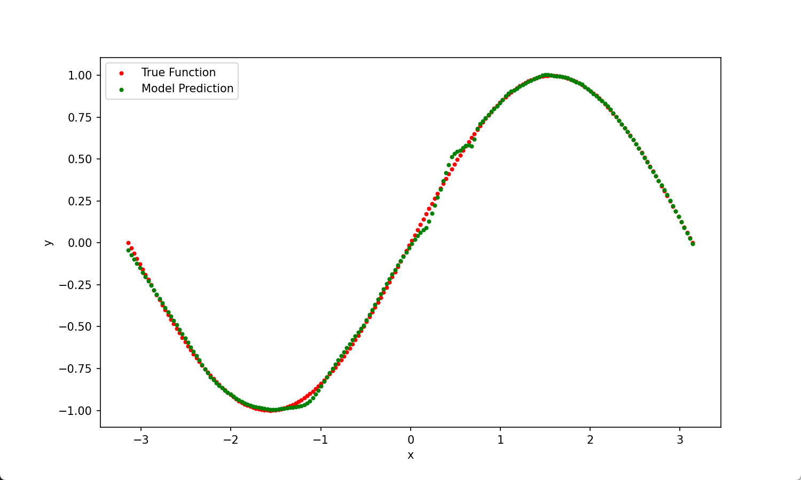
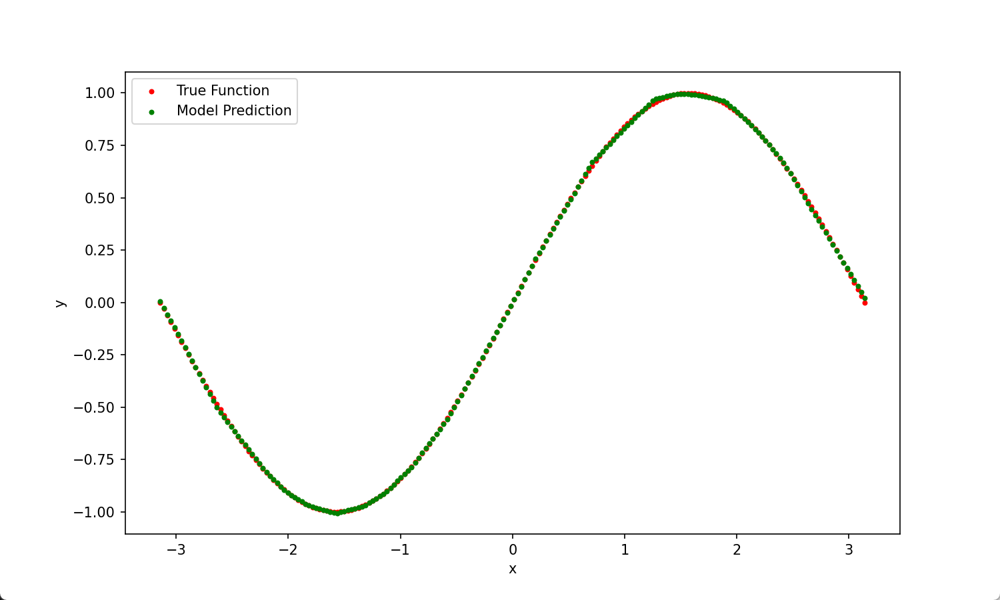

# 实验报告：神经网络拟合正弦函数
2350996 马逸轩

---

## 函数定义

本实验旨在采用一个两层 ReLU 神经网络拟合 sin(x) 正弦函数。

## 数据采集

实验自变量选取在区间 $[-\pi, \pi]$ 间，确保覆盖正弦函数的一个完整周期。采样区间内 1000 个点作为数据集，划分 80% 为训练集，另 20% 为测试集。

## 模型描述

本实验采用两层神经网络，采用 ReLU 激活函数。
- **输入层**：接受单一自变量 x 值
- **隐藏层**：神经元数量设定为 100/200，采用 ReLU 激活
- **输出层**：模型预测的 sin(x) 值

采用 MSE 最小化均方误差作为损失函数，采用梯度下降法更新权重和偏置。学习轮数设定为 10000/20000/50000，轮次越多学习效果越好。

## 拟合效果

隐藏层神经元数量：100
学习轮数：10000
*显著欠拟合*

隐藏层神经元数量：200
学习轮数：20000
*较好贴合真实函数曲线*

隐藏层神经元数量：200
学习轮数：50000
*与真实函数曲线高度重合，拟合效果好*

