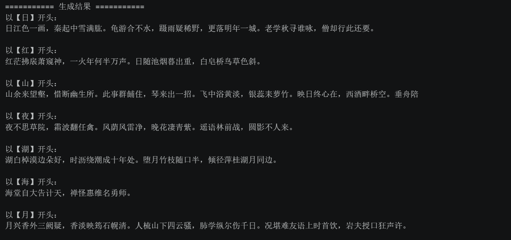
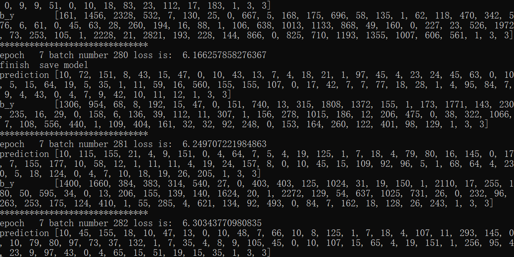
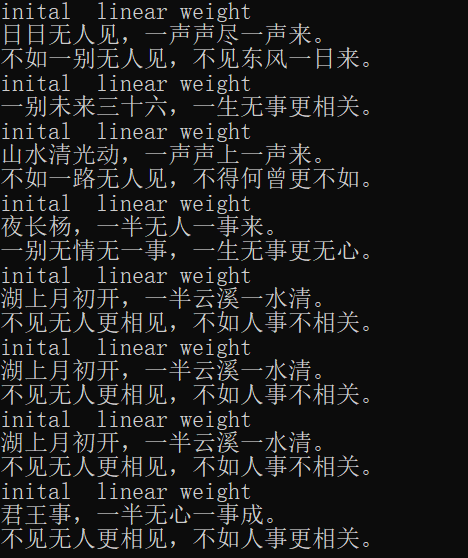

# 实验报告：诗词生成
2350996 马逸轩

---

## 模型阐释

**RNN** 通过隐藏状态在时间上传递信息，形式上为当前状态依赖于输入与前一时刻状态。其问题在于反向传播时梯度连乘，易出现梯度消失或爆炸，难以学习长期依赖。

**LSTM** 在 RNN 基础上引入门控机制（遗忘门、输入门、输出门）和独立的 cell state，使信息可以在时间维度上近似线性传递，从而缓解梯度消失问题，提升长期建模能力，但参数较多、计算开销较大。

**GRU** 是 LSTM 的简化版本，将 cell state 与 hidden state 合并，仅保留更新门和重置门，通过门控实现信息的保留与更新，在减少参数的同时保持较好的性能。

## 生成过程

**训练阶段**：先将每首诗处理为字符序列，并在首尾加入起始符 G 和结束符 E，再构建字符到索引的映射。通过构造“前一个字预测后一个字”的样本对，将序列输入 embedding 和 LSTM 网络，经过全连接层与 LogSoftmax 输出每个位置的下一个字概率，用 NLLLoss 进行优化，使模型学会在给定上下文时预测合理的下一个字符。

**生成阶段**：以给定的起始字开头，将当前已生成序列输入模型，取最后一个位置预测概率最大的字，拼接到序列末尾，重复这一过程，直到生成结束符或达到长度限制。整个过程属于自回归逐字生成

## 生成结果

**Tensorflow**

**PyTorch**

